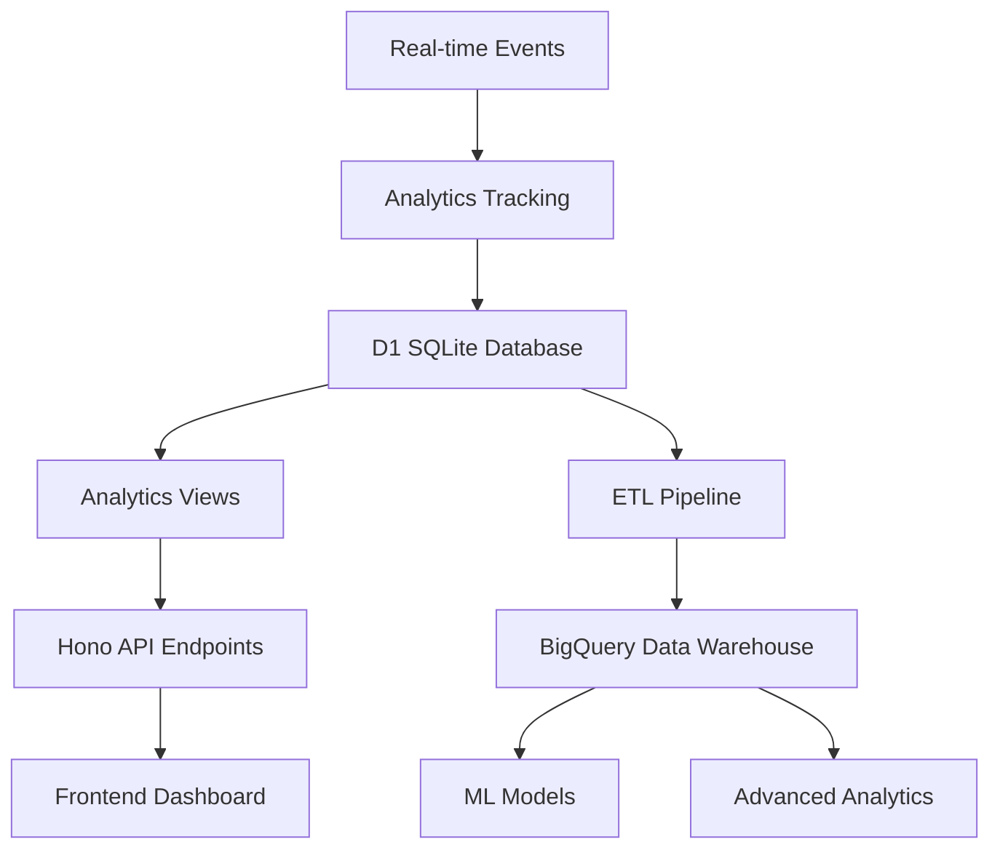

# D&D Character Manager Analytics Implementation Guide

This guide provides comprehensive instructions for implementing the analytics system, including SQL models, API endpoints, BigQuery integration, and data visualization strategies.

## Table of Contents

1. [Analytics Architecture Overview](#analytics-architecture-overview)
2. [Database Setup & Migration](#database-setup--migration)
3. [API Integration](#api-integration)
4. [BigQuery Data Warehouse Setup](#bigquery-data-warehouse-setup)
5. [Data Visualization Strategies](#data-visualization-strategies)
6. [Performance Optimization](#performance-optimization)
7. [Machine Learning Integration](#machine-learning-integration)
8. [A/B Testing Framework](#ab-testing-framework)
9. [Monitoring & Alerting](#monitoring--alerting)
10. [Production Deployment](#production-deployment)

## Analytics Architecture Overview

### System Components



### Key Analytics Modules

1. **Character Build Analytics** - Optimization recommendations and build performance
2. **Campaign Health Metrics** - DM insights and campaign management
3. **Player Engagement** - Retention analysis and churn prediction
4. **Game Balance Analysis** - Statistical models for D&D mechanics
5. **Recommendation Engines** - Personalized suggestions for builds and equipment
6. **Predictive Models** - Character progression and player behavior forecasting

## Database Setup & Migration

### 1. Apply Analytics Schema

```sql
-- Run the main analytics models
.read /database/analytics/dnd_analytics_models.sql

-- Create indexes for performance
CREATE INDEX IF NOT EXISTS idx_usage_analytics_user_timestamp 
ON usage_analytics(user_id, timestamp);

CREATE INDEX IF NOT EXISTS idx_character_equipment_equipped 
ON character_equipment(character_id, is_equipped);

CREATE INDEX IF NOT EXISTS idx_session_snapshots_character 
ON session_character_snapshots(character_id, session_id);
```

### 2. Seed Analytics Events

```sql
-- Insert sample analytics events for testing
INSERT INTO usage_analytics (event_type, user_id, character_id, metadata, timestamp) VALUES
('character_created', 'user-1', 'char-1', '{"source": "campaign_join"}', datetime('now', '-5 days')),
('session_start', 'user-1', 'char-1', '{"duration_estimate": 180}', datetime('now', '-3 days')),
('character_level_up', 'user-1', 'char-1', '{"new_level": 4, "class": "Fighter"}', datetime('now', '-2 days')),
('spell_learned', 'user-2', 'char-2', '{"spell_name": "Fireball", "spell_level": 3}', datetime('now', '-1 day'));
```

## API Integration

### 1. Add Analytics Routes

```typescript
// In your main API router (src/index.ts)
import analytics from './routes/analytics';

app.route('/api/v1/analytics', analytics);
```

### 2. Event Tracking Middleware

```typescript
// src/middleware/analytics.ts
import { Env } from '../types';

export interface AnalyticsEvent {
  event_type: string;
  user_id?: string;
  campaign_id?: string;
  character_id?: string;
  metadata?: Record<string, any>;
}

export async function trackEvent(
  db: Env['DB'], 
  event: AnalyticsEvent
): Promise<void> {
  const id = crypto.randomUUID();
  
  await db.prepare(`
    INSERT INTO usage_analytics (id, event_type, user_id, campaign_id, character_id, metadata)
    VALUES (?, ?, ?, ?, ?, ?)
  `).bind(
    id,
    event.event_type,
    event.user_id || null,
    event.campaign_id || null,
    event.character_id || null,
    event.metadata ? JSON.stringify(event.metadata) : null
  ).run();
}

// Usage in your endpoints
export async function createCharacter(c: Context<{Bindings: Env}>) {
  // ... character creation logic
  
  // Track the event
  await trackEvent(c.env.DB, {
    event_type: 'character_created',
    user_id: userId,
    character_id: newCharacter.id,
    metadata: {
      race: newCharacter.race,
      class: newCharacter.character_class,
      source: 'web_app'
    }
  });
  
  return c.json({ success: true, data: newCharacter });
}
```

### 3. Frontend Integration Examples

```typescript
// Frontend analytics service
class AnalyticsService {
  private baseUrl: string;
  
  constructor(baseUrl: string) {
    this.baseUrl = baseUrl;
  }
  
  // Get character build recommendations
  async getBuildRecommendations(userId: string, preferences: any) {
    const response = await fetch(`${this.baseUrl}/analytics/builds/recommendations`, {
      method: 'POST',
      headers: { 'Content-Type': 'application/json' },
      body: JSON.stringify({ user_id: userId, ...preferences })
    });
    return response.json();
  }
  
  // Get campaign health metrics
  async getCampaignHealth(campaignId?: string) {
    const params = campaignId ? `?campaign_id=${campaignId}` : '';
    const response = await fetch(`${this.baseUrl}/analytics/campaigns/health${params}`);
    return response.json();
  }
  
  // Get player engagement metrics
  async getPlayerEngagement(timeframe = '30d') {
    const response = await fetch(`${this.baseUrl}/analytics/players/engagement?timeframe=${timeframe}`);
    return response.json();
  }
  
  // Get dashboard data for DM
  async getDMDashboard(dmId: string) {
    const response = await fetch(`${this.baseUrl}/analytics/dashboard/dm/${dmId}`);
    return response.json();
  }
}
```

## BigQuery Data Warehouse Setup

### 1. Create BigQuery Dataset and Tables

```sql
-- Create the dataset
CREATE SCHEMA `your-project.dnd_analytics`
OPTIONS(
  description="D&D Character Manager Analytics Data Warehouse",
  location="US"
);

-- Character features table for ML
CREATE TABLE `your-project.dnd_analytics.character_features` (
  character_id STRING,
  user_id STRING,
  campaign_id STRING,
  name STRING,
  race STRING,
  character_class STRING,
  background STRING,
  alignment STRING,
  level INT64,
  experience_points INT64,
  
  -- Normalized ability scores
  strength_normalized FLOAT64,
  dexterity_normalized FLOAT64,
  constitution_normalized FLOAT64,
  intelligence_normalized FLOAT64,
  wisdom_normalized FLOAT64,
  charisma_normalized FLOAT64,
  
  -- Combat stats
  ac_normalized FLOAT64,
  hp_normalized FLOAT64,
  initiative_normalized FLOAT64,
  
  -- Binary features
  high_strength BOOL,
  high_dexterity BOOL,
  high_constitution BOOL,
  high_intelligence BOOL,
  high_wisdom BOOL,
  high_charisma BOOL,
  
  -- Metadata
  created_at TIMESTAMP,
  updated_at TIMESTAMP,
  character_age_days FLOAT64
)
PARTITION BY DATE(created_at)
CLUSTER BY character_class, race;

-- Session events for behavior analysis
CREATE TABLE `your-project.dnd_analytics.session_events` (
  session_id STRING,
  campaign_id STRING,
  character_id STRING,
  user_id STRING,
  session_number INT64,
  session_date DATE,
  duration_minutes INT64,
  experience_awarded INT64,
  
  -- Character progression
  experience_before INT64,
  experience_after INT64,
  level_before INT64,
  level_after INT64,
  xp_gained INT64,
  levels_gained INT64,
  
  -- Session context
  day_of_week INT64,
  hour_of_day INT64,
  long_session BOOL,
  high_xp_session BOOL,
  level_up_session BOOL
)
PARTITION BY session_date
CLUSTER BY campaign_id, character_id;
```

### 2. ETL Pipeline (Cloudflare Workers)

```typescript
// src/workers/bigquery-etl.ts
export default {
  async scheduled(event: ScheduledEvent, env: Env, ctx: ExecutionContext): Promise<void> {
    // Daily ETL job to sync data to BigQuery
    await syncCharacterFeatures(env);
    await syncSessionEvents(env);
  },
};

async function syncCharacterFeatures(env: Env) {
  // Extract character data from D1
  const characters = await env.DB.prepare(`
    SELECT * FROM v_bigquery_character_features
    WHERE updated_at >= DATE('now', '-1 day')
  `).all();

  // Transform and load into BigQuery
  if (characters.results && characters.results.length > 0) {
    await insertToBigQuery(env, 'character_features', characters.results);
  }
}

async function insertToBigQuery(env: Env, table: string, data: any[]) {
  const projectId = env.BIGQUERY_PROJECT_ID;
  const datasetId = 'dnd_analytics';
  
  // Use BigQuery REST API or library
  const response = await fetch(
    `https://bigquery.googleapis.com/bigquery/v2/projects/${projectId}/datasets/${datasetId}/tables/${table}/insertAll`,
    {
      method: 'POST',
      headers: {
        'Authorization': `Bearer ${await getAccessToken(env)}`,
        'Content-Type': 'application/json',
      },
      body: JSON.stringify({
        rows: data.map(row => ({
          insertId: crypto.randomUUID(),
          json: row
        }))
      })
    }
  );
  
  if (!response.ok) {
    console.error('BigQuery insert failed:', await response.text());
    throw new Error('Failed to insert data into BigQuery');
  }
}
```

### 3. Advanced Analytics Queries in BigQuery

```sql
-- Character build effectiveness analysis
WITH build_performance AS (
  SELECT 
    race,
    character_class,
    level,
    COUNT(*) as build_count,
    AVG(ac_normalized + hp_normalized) as avg_survivability,
    PERCENTILE_CONT(experience_points, 0.75) OVER(PARTITION BY level) as level_75th_xp,
    AVG(character_age_days) as avg_progression_time
  FROM `your-project.dnd_analytics.character_features`
  WHERE level >= 3
  GROUP BY race, character_class, level
  HAVING COUNT(*) >= 10
)
SELECT 
  race,
  character_class,
  level,
  build_count,
  avg_survivability,
  avg_progression_time,
  -- Effectiveness score
  (avg_survivability * 0.6 + 
   (level_75th_xp / avg_progression_time) * 0.4) as effectiveness_score
FROM build_performance
ORDER BY effectiveness_score DESC;

-- Player behavior clustering
CREATE MODEL `your-project.dnd_analytics.player_clustering`
OPTIONS(model_type='kmeans', num_clusters=5) AS
WITH player_features AS (
  SELECT 
    user_id,
    COUNT(DISTINCT character_id) as total_characters,
    COUNT(DISTINCT campaign_id) as campaigns_joined,
    AVG(level) as avg_level,
    SUM(duration_minutes) / 60.0 as total_hours,
    COUNT(DISTINCT session_date) as active_days,
    AVG(CASE WHEN level_up_session THEN 1 ELSE 0 END) as level_up_rate
  FROM `your-project.dnd_analytics.session_events`
  GROUP BY user_id
  HAVING total_hours >= 10  -- Filter for engaged players
)
SELECT * EXCEPT(user_id)
FROM player_features;
```

## Data Visualization Strategies

### 1. DM Dashboard Components

```tsx
// React components for DM dashboard
import React from 'react';
import { LineChart, Line, XAxis, YAxis, CartesianGrid, Tooltip, PieChart, Pie, Cell } from 'recharts';

interface DMDashboardProps {
  dmId: string;
}

export const DMDashboard: React.FC<DMDashboardProps> = ({ dmId }) => {
  const [dashboardData, setDashboardData] = useState(null);
  
  useEffect(() => {
    // Fetch dashboard data
    fetchDashboardData(dmId).then(setDashboardData);
  }, [dmId]);
  
  if (!dashboardData) return <div>Loading...</div>;
  
  return (
    <div className="dm-dashboard">
      <div className="metrics-grid">
        <MetricCard 
          title="Active Players" 
          value={dashboardData.overview.active_players} 
          trend="+12% from last month"
        />
        <MetricCard 
          title="Campaign Health" 
          value={dashboardData.overview.avg_health_score}
          trend="Excellent"
        />
        <MetricCard 
          title="Sessions This Month" 
          value={dashboardData.overview.sessions_30d}
          trend="+3 from last month"
        />
      </div>
      
      <div className="charts-grid">
        <div className="chart-container">
          <h3>Session Activity Timeline</h3>
          <LineChart width={600} height={300} data={dashboardData.activity}>
            <CartesianGrid strokeDasharray="3 3" />
            <XAxis dataKey="date" />
            <YAxis />
            <Tooltip />
            <Line type="monotone" dataKey="sessions" stroke="#8884d8" />
            <Line type="monotone" dataKey="active_players" stroke="#82ca9d" />
          </LineChart>
        </div>
        
        <div className="chart-container">
          <h3>Character Class Distribution</h3>
          <PieChart width={400} height={300}>
            <Pie
              data={dashboardData.character_distribution.filter(d => d.dimension === 'class')}
              cx={200}
              cy={150}
              labelLine={false}
              label={({name, percentage}) => `${name} ${percentage}%`}
              outerRadius={80}
              fill="#8884d8"
              dataKey="count"
            >
              {dashboardData.character_distribution.map((entry, index) => (
                <Cell key={`cell-${index}`} fill={COLORS[index % COLORS.length]} />
              ))}
            </Pie>
            <Tooltip />
          </PieChart>
        </div>
      </div>
      
      <PlayerEngagementTable players={dashboardData.players} />
    </div>
  );
};
```

### 2. Player Analytics Dashboard

```tsx
interface PlayerAnalyticsProps {
  userId: string;
}

export const PlayerAnalyticsDashboard: React.FC<PlayerAnalyticsProps> = ({ userId }) => {
  const [analytics, setAnalytics] = useState(null);
  const [recommendations, setRecommendations] = useState(null);
  
  useEffect(() => {
    Promise.all([
      getPlayerEngagement(userId),
      getBuildRecommendations(userId, { exclude_played: true })
    ]).then(([engagement, recs]) => {
      setAnalytics(engagement);
      setRecommendations(recs);
    });
  }, [userId]);
  
  return (
    <div className="player-analytics">
      <div className="engagement-score">
        <CircularProgress 
          value={analytics?.engagement_score} 
          label="Engagement Score"
          color={getScoreColor(analytics?.engagement_score)}
        />
      </div>
      
      <div className="recommendations-panel">
        <h3>Recommended Builds for You</h3>
        {recommendations?.data?.slice(0, 5).map(rec => (
          <BuildRecommendationCard 
            key={`${rec.race}-${rec.character_class}`}
            recommendation={rec}
          />
        ))}
      </div>
      
      <div className="progression-chart">
        <h3>Character Progression</h3>
        <CharacterProgressionChart userId={userId} />
      </div>
    </div>
  );
};
```

### 3. Real-time Campaign Health Monitor

```tsx
export const CampaignHealthMonitor: React.FC<{campaignId: string}> = ({ campaignId }) => {
  const [health, setHealth] = useState(null);
  
  useEffect(() => {
    const interval = setInterval(() => {
      getCampaignHealth(campaignId).then(data => {
        setHealth(data.data[0]);
      });
    }, 30000); // Update every 30 seconds
    
    return () => clearInterval(interval);
  }, [campaignId]);
  
  const getHealthColor = (score: number) => {
    if (score >= 80) return '#4CAF50';
    if (score >= 60) return '#FF9800';
    return '#F44336';
  };
  
  return (
    <div className="health-monitor">
      <div className="health-score" style={{ color: getHealthColor(health?.health_score) }}>
        <span className="score">{health?.health_score}</span>
        <span className="label">Health Score</span>
      </div>
      
      <div className="health-indicators">
        <HealthIndicator 
          label="Days Since Last Session"
          value={health?.days_since_last_session}
          threshold={14}
          invert={true}
        />
        <HealthIndicator 
          label="Active Players"
          value={health?.active_players}
          threshold={3}
        />
        <HealthIndicator 
          label="Sessions Per Week"
          value={health?.sessions_per_week}
          threshold={1}
        />
      </div>
      
      <div className="recommendations">
        {health?.recommendations?.map(rec => (
          <RecommendationCard key={rec.type} recommendation={rec} />
        ))}
      </div>
    </div>
  );
};
```

## Performance Optimization

### 1. Database Indexing Strategy

```sql
-- Primary performance indexes
CREATE INDEX idx_characters_composite ON characters(character_class, race, level, user_id);
CREATE INDEX idx_sessions_date_campaign ON campaign_sessions(date DESC, campaign_id);
CREATE INDEX idx_analytics_user_time ON usage_analytics(user_id, timestamp DESC);
CREATE INDEX idx_equipment_character_equipped ON character_equipment(character_id, is_equipped, equipment_id);

-- Materialized views for expensive queries (if supported)
CREATE MATERIALIZED VIEW mv_daily_engagement AS
SELECT 
  DATE(timestamp) as date,
  COUNT(DISTINCT user_id) as daily_active_users,
  COUNT(*) as total_events,
  COUNT(DISTINCT event_type) as event_types
FROM usage_analytics
GROUP BY DATE(timestamp);
```

### 2. Caching Strategy

```typescript
// src/middleware/cache.ts
interface CacheConfig {
  ttl: number;
  key: string;
}

export function withCache(config: CacheConfig) {
  return async (c: Context, next: Next) => {
    const cacheKey = `analytics:${config.key}:${JSON.stringify(c.req.query())}`;
    
    // Try to get from cache
    const cached = await c.env.CACHE?.get(cacheKey);
    if (cached) {
      return c.json(JSON.parse(cached));
    }
    
    // Execute the handler
    await next();
    
    // Cache the response
    const response = await c.res.clone();
    const data = await response.json();
    
    await c.env.CACHE?.put(cacheKey, JSON.stringify(data), {
      expirationTtl: config.ttl
    });
  };
}

// Usage
analytics.get('/campaigns/health',
  withCache({ ttl: 300, key: 'campaign_health' }), // 5 minute cache
  async (c) => {
    // ... query logic
  }
);
```

### 3. Query Optimization

```sql
-- Optimize heavy analytics queries with CTEs and proper indexing
WITH RECURSIVE campaign_player_activity AS (
  -- Use recursive CTE for complex hierarchical data
  SELECT 
    c.id as campaign_id,
    cm.user_id,
    0 as level
  FROM campaigns c
  JOIN campaign_members cm ON c.id = cm.campaign_id
  WHERE c.is_active = true
  
  UNION ALL
  
  SELECT 
    cpa.campaign_id,
    cpa.user_id,
    cpa.level + 1
  FROM campaign_player_activity cpa
  JOIN session_character_snapshots scs ON cpa.user_id = scs.character_id
  WHERE cpa.level < 10
)
SELECT 
  campaign_id,
  COUNT(DISTINCT user_id) as engaged_players
FROM campaign_player_activity
GROUP BY campaign_id;
```

## Machine Learning Integration

### 1. Character Build Optimization Model

```python
# BigQuery ML model for build recommendations
CREATE MODEL `your-project.dnd_analytics.build_optimizer`
OPTIONS(
  model_type='boosted_tree_regressor',
  input_label_cols=['survivability_score']
) AS
SELECT
  race,
  character_class,
  background,
  strength_normalized,
  dexterity_normalized,
  constitution_normalized,
  intelligence_normalized,
  wisdom_normalized,
  charisma_normalized,
  ac_normalized + hp_normalized as survivability_score
FROM `your-project.dnd_analytics.character_features`
WHERE level >= 3;

-- Use the model for predictions
SELECT *
FROM ML.PREDICT(MODEL `your-project.dnd_analytics.build_optimizer`, (
  SELECT 
    'Half-Elf' as race,
    'Ranger' as character_class,
    'Outlander' as background,
    0.2 as strength_normalized,
    0.8 as dexterity_normalized,
    0.4 as constitution_normalized,
    0.0 as intelligence_normalized,
    0.6 as wisdom_normalized,
    0.3 as charisma_normalized
));
```

### 2. Player Churn Prediction

```python
# Churn prediction model
CREATE MODEL `your-project.dnd_analytics.churn_predictor`
OPTIONS(
  model_type='logistic_reg',
  input_label_cols=['is_churned']
) AS
WITH player_features AS (
  SELECT
    user_id,
    days_since_last_activity,
    sessions_30d,
    total_characters,
    avg_session_duration,
    engagement_score,
    CASE WHEN days_since_last_activity >= 30 THEN 1 ELSE 0 END as is_churned
  FROM `your-project.dnd_analytics.player_engagement_features`
  WHERE account_age_days >= 30
)
SELECT * EXCEPT(user_id)
FROM player_features;
```

### 3. Dynamic Difficulty Adjustment

```sql
-- Model for suggesting encounter difficulty
CREATE MODEL `your-project.dnd_analytics.encounter_difficulty`
OPTIONS(
  model_type='linear_reg',
  input_label_cols=['encounter_rating']
) AS
SELECT
  party_average_level,
  party_size,
  total_party_hp,
  average_party_ac,
  session_duration_minutes,
  previous_encounter_rating,
  encounter_rating
FROM `your-project.dnd_analytics.encounter_history`
WHERE encounter_rating IS NOT NULL;
```

## A/B Testing Framework

### 1. Test Configuration

```typescript
// src/lib/ab-testing.ts
interface ABTest {
  id: string;
  name: string;
  variants: Array<{
    name: string;
    weight: number;
    config: Record<string, any>;
  }>;
  isActive: boolean;
  successMetric: string;
}

export class ABTestingService {
  constructor(private db: D1Database) {}
  
  async assignUserToTest(userId: string, testId: string): Promise<string> {
    // Check if user already assigned
    const existing = await this.db.prepare(`
      SELECT variant_name FROM ab_test_assignments 
      WHERE user_id = ? AND test_id = ?
    `).bind(userId, testId).first();
    
    if (existing) {
      return existing.variant_name as string;
    }
    
    // Get test configuration
    const test = await this.db.prepare(`
      SELECT variants FROM ab_tests WHERE id = ? AND is_active = true
    `).bind(testId).first();
    
    if (!test) {
      throw new Error(`Test ${testId} not found or inactive`);
    }
    
    const variants = JSON.parse(test.variants as string);
    const selectedVariant = this.selectVariant(variants, userId);
    
    // Store assignment
    await this.db.prepare(`
      INSERT INTO ab_test_assignments (id, test_id, user_id, variant_name)
      VALUES (?, ?, ?, ?)
    `).bind(crypto.randomUUID(), testId, userId, selectedVariant).run();
    
    return selectedVariant;
  }
  
  private selectVariant(variants: any[], userId: string): string {
    // Use consistent hashing for deterministic assignment
    const hash = this.hashUserId(userId);
    const totalWeight = variants.reduce((sum, v) => sum + v.weight, 0);
    const threshold = hash % totalWeight;
    
    let currentWeight = 0;
    for (const variant of variants) {
      currentWeight += variant.weight;
      if (threshold < currentWeight) {
        return variant.name;
      }
    }
    
    return variants[0].name; // fallback
  }
  
  private hashUserId(userId: string): number {
    let hash = 0;
    for (let i = 0; i < userId.length; i++) {
      const char = userId.charCodeAt(i);
      hash = ((hash << 5) - hash) + char;
      hash = hash & hash; // Convert to 32-bit integer
    }
    return Math.abs(hash);
  }
}
```

### 2. Feature Flag Integration

```typescript
// src/middleware/feature-flags.ts
export async function withFeatureFlag(testId: string, feature: string) {
  return async (c: Context, next: Next) => {
    const userId = c.get('userId');
    if (!userId) {
      return next();
    }
    
    const abTesting = new ABTestingService(c.env.DB);
    const variant = await abTesting.assignUserToTest(userId, testId);
    
    // Add variant info to context
    c.set('abVariant', { testId, variant, feature });
    
    return next();
  };
}

// Usage in routes
analytics.get('/builds/recommendations',
  withFeatureFlag('build_rec_v2', 'enhanced_recommendations'),
  async (c) => {
    const variant = c.get('abVariant');
    
    if (variant?.variant === 'enhanced_v2') {
      // Use enhanced recommendation algorithm
      return getEnhancedRecommendations(c);
    } else {
      // Use standard algorithm
      return getStandardRecommendations(c);
    }
  }
);
```

## Monitoring & Alerting

### 1. Analytics Health Monitoring

```typescript
// src/workers/analytics-monitor.ts
export default {
  async scheduled(event: ScheduledEvent, env: Env): Promise<void> {
    await checkAnalyticsHealth(env);
  },
};

async function checkAnalyticsHealth(env: Env) {
  const checks = [
    checkDataFreshness(env),
    checkQueryPerformance(env),
    checkErrorRates(env),
    checkEngagementMetrics(env)
  ];
  
  const results = await Promise.allSettled(checks);
  
  const failures = results
    .map((result, index) => ({ result, check: checks[index].name }))
    .filter(({ result }) => result.status === 'rejected');
  
  if (failures.length > 0) {
    await sendAlert(env, {
      type: 'analytics_health_check_failed',
      failures: failures.map(f => f.check)
    });
  }
}

async function checkDataFreshness(env: Env) {
  const lastEvent = await env.DB.prepare(`
    SELECT timestamp FROM usage_analytics 
    ORDER BY timestamp DESC LIMIT 1
  `).first();
  
  const hoursOld = (Date.now() - new Date(lastEvent.timestamp).getTime()) / (1000 * 60 * 60);
  
  if (hoursOld > 6) {
    throw new Error(`Analytics data is ${hoursOld.toFixed(1)} hours old`);
  }
}

async function sendAlert(env: Env, alert: any) {
  // Send to monitoring service (e.g., Slack, PagerDuty)
  await fetch(env.SLACK_WEBHOOK_URL, {
    method: 'POST',
    headers: { 'Content-Type': 'application/json' },
    body: JSON.stringify({
      text: `🚨 D&D Analytics Alert: ${alert.type}`,
      attachments: [{
        color: 'danger',
        fields: alert.failures.map(f => ({ title: f, value: 'Failed', short: true }))
      }]
    })
  });
}
```

### 2. Performance Metrics

```typescript
// src/middleware/metrics.ts
export async function collectMetrics(c: Context, next: Next) {
  const startTime = Date.now();
  const endpoint = c.req.path;
  
  try {
    await next();
    
    const duration = Date.now() - startTime;
    const status = c.res.status;
    
    // Log metrics
    console.log(JSON.stringify({
      timestamp: new Date().toISOString(),
      endpoint,
      method: c.req.method,
      status,
      duration_ms: duration,
      user_id: c.get('userId')
    }));
    
    // Track in analytics if needed
    if (duration > 1000) { // Slow query
      await trackEvent(c.env.DB, {
        event_type: 'slow_analytics_query',
        metadata: { endpoint, duration_ms: duration }
      });
    }
    
  } catch (error) {
    const duration = Date.now() - startTime;
    
    console.error(JSON.stringify({
      timestamp: new Date().toISOString(),
      endpoint,
      method: c.req.method,
      status: 500,
      duration_ms: duration,
      error: error.message
    }));
    
    throw error;
  }
}
```

## Production Deployment

### 1. Environment Configuration

```toml
# wrangler.toml
[env.production]
name = "dnd-analytics-prod"
compatibility_date = "2024-01-01"

[[env.production.d1_databases]]
binding = "DB"
database_name = "dnd-character-manager-prod"
database_id = "your-production-database-id"

[env.production.vars]
ENVIRONMENT = "production"
BIGQUERY_PROJECT_ID = "your-project-id"

[[env.production.kv_namespaces]]
binding = "CACHE"
id = "your-cache-namespace-id"

[[env.production.analytics]]
binding = "ANALYTICS"
dataset = "dnd_analytics_prod"
```

### 2. Deployment Scripts

```bash
#!/bin/bash
# deploy.sh

# Deploy analytics views
echo "Deploying analytics views..."
wrangler d1 execute dnd-character-manager-prod --file=database/analytics/dnd_analytics_models.sql --env production

# Deploy API
echo "Deploying API..."
npm run build
wrangler deploy --env production

# Run data migration if needed
echo "Running data migration..."
wrangler d1 execute dnd-character-manager-prod --file=database/migrations/add_analytics_indexes.sql --env production

# Verify deployment
echo "Verifying deployment..."
curl -f https://your-api-domain.com/api/v1/analytics/kpis/overview || exit 1

echo "✅ Analytics deployment complete!"
```

### 3. Monitoring Setup

```yaml
# monitoring/alerts.yaml
alerts:
  - name: Analytics API Error Rate
    condition: error_rate > 5%
    duration: 5m
    severity: warning
    
  - name: Analytics Data Freshness
    condition: last_event_age > 6h
    duration: 1m
    severity: critical
    
  - name: Campaign Health Alert
    condition: campaigns_at_risk > 10
    duration: 15m
    severity: warning
    notification: dm_channel
```

## Usage Examples

### 1. Getting Character Build Recommendations

```bash
# Get build recommendations for a user
curl "https://your-api.com/api/v1/analytics/builds/recommendations" \
  -X POST \
  -H "Content-Type: application/json" \
  -d '{
    "user_id": "user-123",
    "preferred_role": "dps",
    "experience_level": "intermediate",
    "exclude_played": true
  }'
```

### 2. Monitoring Campaign Health

```bash
# Get health metrics for all campaigns
curl "https://your-api.com/api/v1/analytics/campaigns/health?timeframe=30d"

# Get specific campaign health
curl "https://your-api.com/api/v1/analytics/campaigns/health?campaign_id=campaign-456"
```

### 3. Player Engagement Analysis

```bash
# Get player engagement metrics
curl "https://your-api.com/api/v1/analytics/players/engagement?limit=50"

# Get retention cohort analysis
curl "https://your-api.com/api/v1/analytics/players/retention-cohorts"
```

This comprehensive analytics system will give your D&D Character Manager application significant competitive advantages through data-driven insights, personalized recommendations, and proactive campaign management tools.