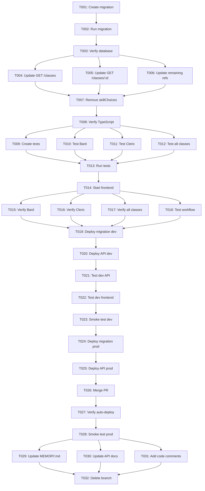

# Tasks: Class Skill Display Bug Fix

**Feature**: 003-class-skill-display-fix
**Branch**: `003-class-skill-display-fix`
**Estimated Time**: 2-3 hours
**Type**: Bug Fix

## Summary

Fix class skill count display bug where Bard shows "3 of 0" instead of "3 of 18". Root cause is API returning flat `skillProficiencies` array instead of nested `skill_proficiencies: {choose, from}` structure expected by frontend.

**Solution**: Update Bard database to have all 18 skills, change API response structure to match frontend TypeScript interface.

---

## Phase 1: Database Migration

**Goal**: Update Bard class to have complete skill list (all 18 D&D 5e skills)

### Tasks

- [ ] T001 Create database/migrations/023_fix_bard_skill_list.sql with UPDATE statement for Bard class
- [ ] T002 Run migration 023 on local development database using wrangler CLI
- [ ] T003 Verify Bard has 18 skills in database by querying classes table

**Completion Criteria**:
- Migration file exists with correct SQL
- Bard record updated in dev database
- Query returns 18 skills in `skill_proficiencies` column

**Independent Test**:
```bash
# From api/ directory
npx wrangler d1 execute dnd-character-manager-dev \
  --command="SELECT id, name, skill_proficiencies FROM classes WHERE id='bard'"

# Expected: skill_proficiencies contains 18 skill names
```

---

## Phase 2: API Response Structure Update

**Goal**: Update API to return nested `skill_proficiencies: {choose, from}` structure

### Tasks

- [ ] T004 [P] Update api/src/routes/classes.ts GET /api/classes endpoint to return nested skill_proficiencies structure
- [ ] T005 [P] Update api/src/routes/classes.ts GET /api/classes/:id endpoint to return nested skill_proficiencies structure
- [ ] T006 [P] Search api/src/routes/classes.ts for remaining skillProficiencies references and update to nested format
- [ ] T007 [P] Remove skillChoices field from API response (merged into skill_proficiencies.choose)
- [ ] T008 Verify TypeScript compilation passes for api/src/routes/classes.ts

**Completion Criteria**:
- All class endpoints return `skill_proficiencies: {choose, from}`
- No separate `skillChoices` field in response
- TypeScript compiles without errors
- Field name is `skill_proficiencies` (snake_case) not `skillProficiencies` (camelCase)

**Independent Test**:
```bash
# Start API locally: cd api && npm run dev
curl http://localhost:8787/api/classes/bard | jq '.data.skill_proficiencies'

# Expected output:
# {
#   "choose": 3,
#   "from": ["Acrobatics", "Animal Handling", ..., "Survival"]
# }
```

---

## Phase 3: API Testing

**Goal**: Ensure API contract is correct and all classes return proper structure

### Tasks

- [ ] T009 [P] Create or update api/tests/routes/classes.test.ts with test for skill_proficiencies structure
- [ ] T010 [P] Add test case verifying Bard has skill_proficiencies.choose = 3 and from.length = 18
- [ ] T011 [P] Add test case verifying Cleric has skill_proficiencies.choose = 2 and from.length = 5
- [ ] T012 [P] Add test case checking all 12 classes have skill_proficiencies object with choose and from properties
- [ ] T013 Run API test suite and verify all tests pass

**Completion Criteria**:
- Test file exists with 4+ test cases for skill_proficiencies structure
- All tests pass when running `npm test` in api/ directory
- Coverage includes Bard (18 skills), Cleric (5 skills), and all other classes

**Independent Test**:
```bash
cd api
npm test -- classes.test.ts

# All tests should pass
```

---

## Phase 4: Frontend Verification

**Goal**: Verify frontend displays correct skill counts without code changes

### Tasks

- [ ] T014 Start frontend development server and navigate to /characters/new
- [ ] T015 Verify Bard displays "Skills: 3 of 18" in class selector card
- [ ] T016 Verify Cleric displays "Skills: 2 of 5" in class selector card
- [ ] T017 Verify all 12 classes display "X of Y" format (no "X of 0" errors)
- [ ] T018 Test character creation flow: select Bard → navigate to Skills step → verify 18 skills available

**Completion Criteria**:
- Frontend connects to local API successfully
- ClassSelector.tsx displays correct counts for all classes
- No "X of 0" display bugs
- Character creation wizard Skills & Proficiencies step shows complete skill lists

**Independent Test**:
Manual testing checklist:
1. Navigate to http://localhost:5173/characters/new
2. Check each class card for correct "Skills: X of Y" display
3. Select Bard → Next → Navigate to Skills & Proficiencies
4. Verify 18 skills are available for selection

---

## Phase 5: Integration Testing & Deployment

**Goal**: Deploy to dev environment and verify end-to-end functionality

### Tasks

- [ ] T019 Deploy migration 023 to development database (Cloudflare D1)
- [ ] T020 Deploy API changes to development environment (Cloudflare Workers)
- [ ] T021 Test development API endpoint GET /api/classes/bard returns correct structure
- [ ] T022 Test development frontend displays correct skill counts for all classes
- [ ] T023 Run smoke test: complete character creation flow with Bard class on development

**Completion Criteria**:
- Migration applied to development database
- Development API returns nested skill_proficiencies structure
- Development frontend shows "Skills: 3 of 18" for Bard
- End-to-end character creation flow completes successfully

**Independent Test**:
```bash
# Test development API
curl https://dnd-character-manager-api-dev.cybermattlee-llc.workers.dev/api/classes/bard | jq '.data.skill_proficiencies'

# Open development frontend
# Navigate to https://dnd.cyberlees.dev/characters/new
# Verify Bard shows "Skills: 3 of 18"
```

---

## Phase 6: Production Deployment

**Goal**: Deploy fix to production after dev verification

### Tasks

- [ ] T024 Deploy migration 023 to production database (Cloudflare D1)
- [ ] T025 Deploy API changes to production environment (Cloudflare Workers)
- [ ] T026 Merge feature branch to main via pull request
- [ ] T027 Verify production frontend auto-deploys via Cloudflare Pages
- [ ] T028 Run production smoke test: verify class skill counts on https://dnd.cyberlees.dev

**Completion Criteria**:
- Production database updated
- Production API deployed successfully
- Pull request merged to main
- Production frontend shows correct skill counts
- No errors in production logs

**Independent Test**:
```bash
# Test production API
curl https://dnd-character-manager-api-prod.cybermattlee-llc.workers.dev/api/classes/bard | jq '.data.skill_proficiencies'

# Manual verification
# Open https://dnd.cyberlees.dev/characters/new
# Check Bard displays "Skills: 3 of 18"
```

---

## Phase 7: Documentation & Cleanup

**Goal**: Update project documentation and close feature branch

### Tasks

- [ ] T029 [P] Update MEMORY.md with Session details documenting bug fix and deployment
- [ ] T030 [P] Update API documentation (if exists) with new skill_proficiencies structure
- [ ] T031 [P] Add inline code comments documenting Bug #003 fix in api/src/routes/classes.ts
- [ ] T032 Delete feature branch 003-class-skill-display-fix after merge

**Completion Criteria**:
- MEMORY.md updated with deployment details
- Code comments reference Bug #003
- Feature branch deleted
- Git history clean

---

## Task Dependencies



## Parallel Execution Opportunities

### Phase 2 (API Updates)
Tasks T004, T005, T006, T007 can be executed in parallel:
- Different endpoints (T004 vs T005)
- Different file sections (T006)
- Cleanup task (T007)

**Parallelization Example**:
```bash
# Terminal 1
# T004: Update GET /classes endpoint

# Terminal 2
# T005: Update GET /classes/:id endpoint

# Terminal 3
# T006: Search for remaining references

# After all complete, run T007 and T008 sequentially
```

### Phase 3 (Testing)
Tasks T009, T010, T011, T012 can be written in parallel:
- Different test cases
- Different test files/sections

**Parallelization Example**:
```bash
# Write all test cases in parallel, then run T013 to execute them
```

### Phase 7 (Documentation)
Tasks T029, T030, T031 can be executed in parallel:
- Different documentation files
- Independent updates

---

## Implementation Strategy

### MVP Scope
Minimum viable fix:
- Phase 1: Database migration ✅
- Phase 2: API structure update ✅
- Phase 3: Basic API tests ✅
- Phase 4: Frontend verification ✅
- Phase 5: Development deployment ✅

**Time**: ~2 hours

### Full Completion
All phases including:
- Production deployment
- Comprehensive testing
- Documentation updates

**Time**: ~3 hours

### Incremental Delivery
1. **Iteration 1** (1 hour): Phases 1-2 (Database + API)
   - Test: API returns correct structure locally

2. **Iteration 2** (30 min): Phase 3 (Tests)
   - Test: All API tests pass

3. **Iteration 3** (30 min): Phase 4 (Frontend verification)
   - Test: Frontend displays correct counts locally

4. **Iteration 4** (1 hour): Phases 5-7 (Deployment + Docs)
   - Test: Production works end-to-end

---

## Summary Statistics

**Total Tasks**: 32
**Parallelizable Tasks**: 11 (34%)
**Sequential Dependencies**: 21 chains
**Estimated Time**: 2-3 hours
**Phases**: 7

**Task Breakdown by Phase**:
- Phase 1 (Database): 3 tasks (15 min)
- Phase 2 (API): 5 tasks (30 min)
- Phase 3 (Tests): 5 tasks (45 min)
- Phase 4 (Frontend): 5 tasks (30 min)
- Phase 5 (Dev Deploy): 5 tasks (30 min)
- Phase 6 (Prod Deploy): 5 tasks (15 min)
- Phase 7 (Documentation): 4 tasks (15 min)

**Critical Path**: T001 → T002 → T003 → T004 → T007 → T008 → T013 → T014 → T019 → T020 → T024 → T025 → T026 → T028 → T032

**Files Modified**:
- `database/migrations/023_fix_bard_skill_list.sql` (create)
- `api/src/routes/classes.ts` (update)
- `api/tests/routes/classes.test.ts` (create or update)
- `MEMORY.md` (update)

**Files Already Correct** (no changes needed):
- `frontend/src/types/dnd5e.ts`
- `frontend/src/components/character-creation/ClassSelector.tsx`
- `frontend/src/services/dnd5eApi.ts`

---

## Related Documentation

- **Spec**: [spec.md](./spec.md) - Original problem statement
- **Research**: [research.md](./research.md) - Investigation findings
- **Data Model**: [data-model.md](./data-model.md) - Entity definitions
- **API Contract**: [contracts/classes-api.yaml](./contracts/classes-api.yaml) - OpenAPI spec
- **Quickstart**: [quickstart.md](./quickstart.md) - Detailed implementation guide
- **Plan**: [plan.md](./plan.md) - Technical context

**Status**: ✅ Tasks ready for implementation
